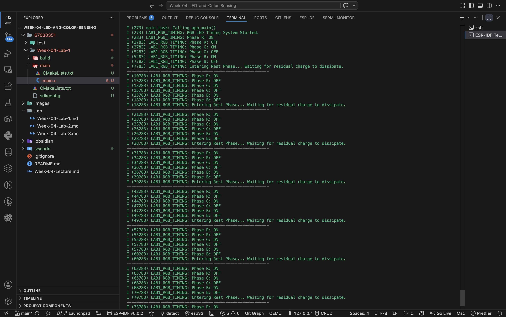
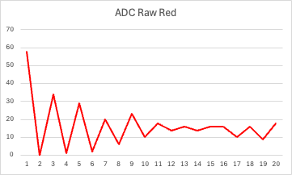
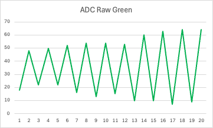
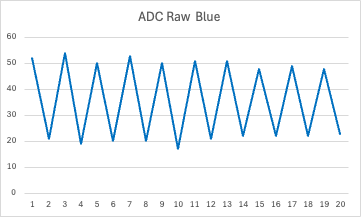

# บันทึกผลการทดลอง 
## ใบงานปฏิบัติการ สัปดาห์ที่ 4 การทดลองย่อยที่ 1
### หัวข้อ: การควบคุมจังหวะเวลาเอาต์พุตดิจิทัล (Time-Domain Multiplexing with RGB LED)

#### จาก `idf.py monitor` 


#### 4.2 จากการสังเกตุ LED 
https://youtube.com/shorts/BDVmfTSnCWI?si=qIxMIWpnXd7kApya

---

## ใบงานปฏิบัติการ สัปดาห์ที่ 4 การทดลองย่อยที่ 2
### หัวข้อ: การศึกษากลศาสตร์ประจุแฝงและพฤติกรรมการตอบสนองของ ADC (ADC Settling Time & Transient State)

#### 1. ผลการทดลองจาก Serial Monitor (`idf.py monitor`)

```text
I (287) LAB2_ADC_SETTLING: Transient Observation System Online (Calibrated) on GPIO 2 (ADC2_CH2)
==============================================================
Color R:
No, ADC Raw
1, 58
2, 0
3, 34
4, 1
5, 29
6, 2
7, 20
8, 6
9, 23
10, 10
11, 18
12, 14
13, 16
14, 14
15, 16
16, 16
17, 10
18, 16
19, 9
20, 18
--------------------------------------------------------------
Color G:
No, ADC Raw
1, 18
2, 48
3, 22
4, 50
5, 22
6, 52
7, 16
8, 54
9, 13
10, 54
11, 15
12, 53
13, 10
14, 60
15, 10
16, 63
17, 7
18, 64
19, 9
20, 64
--------------------------------------------------------------
Color B:
No, ADC Raw
1, 52
2, 21
3, 54
4, 19
5, 50
6, 20
7, 53
8, 20
9, 50
10, 17
11, 51
12, 21
13, 51
14, 22
15, 48
16, 22
17, 49
18, 22
19, 48
20, 23
==============================================================
```

#### 2. กิจกรรมวิเคราะห์ผลและการบ้านท้ายใบงาน (Data Science & Engineering Reflection)

##### 4.1 การพล็อตกราฟพฤติกรรมทางกายภาพ (Transient Response Curve)
* **ตารางสรุปไฟล์ข้อมูลทั้งหมด**: <br>




##### 4.2 คำถามนำเพื่อการวิเคราะห์เชิงระบบ (Critical Thinking)

###### 1. จากกราฟที่พล๊อตออกมา นักศึกษาสังเกตเห็นแนวโน้มตัวเลขของค่า ADC ตั้งแต่แซมเปิ้ลที่ 1 ไต่ระดับลงมาหรือขึ้นไปจนถึงแซมเปิ้ลที่ 20 อย่างไร?
**ตอบ**: 
* **Red ADC Raw (สีแดง)**: แสดงแนวโน้มการคายประจุแฝงที่ชัดเจน โดยค่า ADC ในแซมเปิ้ลที่ 1 พุ่งขึ้นไปสูงสุดที่ **58** (Transient State) จากนั้นยอดพีกมีแนวโน้ม **ไต่ระดับลดลงมาแบบเอ็กซ์โพเนนเชียล (Exponential Decay Slope)** จาก $58 \rightarrow 34 \rightarrow 29 \rightarrow 20 \rightarrow 18 \rightarrow 16$ จนกระทั่งเข้าสู่สภาวะเสถียร (Steady State) ที่ระดับประมาณ 10–18
* **Green & Blue ADC Raw (สีเขียวและสีน้ำเงิน)**: แสดงแนวโน้มการแกว่งแบบฟันปลา (Sawtooth Pattern) สลับระหว่างระดับต่ำ (~10–20) และระดับสูง (~50–64) สม่ำเสมอ ซึ่งเกิดจากสัญญาณรบกวน (Noise/Aliasing) จากไฟส่องสว่างในห้อง (50Hz) เนื่องจากหลอด LED ภาครับตอบสนองต่อช่วงความยาวคลื่นสีเขียวและน้ำเงินได้น้อยกว่าสีแดง

###### 2. สัญญาณไฟฟ้าเข้าสู่ความนิ่ง (Settling) ที่แซมเปิ้ลใด หรือใช้เวลากี่มิลลิวินาที?
**ตอบ**: 
* สัญญาณไฟฟ้า (จากกราฟสีแดง) เริ่มเข้าสู่สภาวะความนิ่ง (Settling State) ที่ **แซมเปิ้ลที่ 11 ถึง 13**
* **การคำนวณเวลา (Settling Time)**: 
  เนื่องจากแต่ละแซมเปิ้ลมีระยะเวลาหน่วงสุ่มอ่าน $\text{SAMPLING\_DELAY\_MS} = 150\text{ ms}$
  $$\text{Settling Time} = 11 \times 150\text{ ms} = 1,650\text{ ms} \quad (\text{หรือประมาณ } 1.65\text{ วินาที})$$
  ดังนั้น ระบบใช้เวลาคายประจุแฝงและปรับตัวเข้าสู่ความนิ่งประมาณ **1.65 วินาที (1,650 มิลลิวินาที)** หลังจากการตัดไฟ LED ภาคส่ง

###### 3. ความลาดเอียงของเส้นกราฟที่เกิดขึ้นในช่วงแรกของการสลับสถานะไฟนี้ เป็นหลักฐานเชิงประจักษ์สะท้อนข้อจำกัดคุณสมบัติทางกายภาพใดของรอยต่อ PN บน LED ภาครับ และโครงสร้างตัวเก็บประจุสุ่มสัญญาณภายในไมโครคอนโทรลเลอร์?
**ตอบ**: 
ความลาดเอียง (Discharge Slope) สะท้อนข้อจำกัดทางกายภาพ 2 ส่วนหลัก คือ:
1. **ความจุไฟฟ้าแฝงของรอยต่อ PN (Junction / Parasitic Capacitance)**: เมื่อ LED ภาครับถูกกระตุ้นด้วยแสง จะเกิดประจุไฟฟ้าสะสมในรอยต่อ PN เมื่อสั่งดับไฟ LED ภาคส่ง ประจุที่ค้างอยู่นี้จะไม่หมดไปทันที แต่จะค่อยๆ คายประจุออกตามค่าคงเวลา RC (RC Discharge Time Constant)
2. **ตัวเก็บประจุสุ่มสัญญาณภายใน ADC ($C_{\text{sample}}$ & High Source Impedance)**: วงจร ADC ภายใน ESP32 มีตัวเก็บประจุสุ่มและคงค่าสัญญาณ ($C_{\text{sample}}$) ซึ่งเมื่อทำงานร่วมกับ LED ภาครับที่มีอิมพีแดนซ์สูงมาก (High Source Impedance) การประจุและคายประจุของ $C_{\text{sample}}$ จึงต้องใช้เวลานานในการไต่ระดับแรงดันให้เข้าสู่ค่าที่แท้จริง เกิดเป็นความลาดเอียงของ Settling Time ดังกล่าว

###### 4. หากในใบงานถัดไปเราต้องการ "หาค่าเฉลี่ยของระดับแรงดันสะท้อนที่แท้จริง" โดยไม่ให้เฟสสัญญาณที่กำลังเปลี่ยนแปลง (Transient State) นี้ไปดึงค่าสถิติให้เพี้ยน นักศึกษาคิดว่าเราควรเลือกแซมเปิ้ลช่วงใดมาคำนวณ หรือควรเขียนโปรแกรมหน่วงเวลาหลบเลี่ยงอาการ Settling นี้อย่างไร?
**ตอบ**: 
1. **การเลือกช่วงแซมเปิ้ลคำนวณ (Sampling Window Selection)**: ควรตัดแซมเปิ้ลช่วงแรกที่มีอาการ Transient (แซมเปิ้ลที่ 1 ถึง 10) ทิ้งไป และเลือกเฉพาะแซมเปิ้ลช่วงท้ายที่สัญญาณเข้าสู่ความนิ่งแล้ว คือ **แซมเปิ้ลที่ 11 ถึง 20** นำมาคำนวณหาค่าเฉลี่ย (Average)
2. **การเขียนโปรแกรมหน่วงเวลาหลบหลีก (Settling Delay Technique)**: หลังจากสั่งเปลี่ยนสถานะไฟ LED ภาคส่ง ควร **เขียนโปรแกรมหน่วงเวลา (vTaskDelay)** รอให้สัญญาณอนาล็อกเข้าสู่ความนิ่งอย่างน้อย **1.5 ถึง 2.0 วินาที** ก่อนที่จะเริ่มคำสั่งอ่านค่า ADC (`adc_oneshot_read`) หรือใช้อัลกอริทึม **Trimmed Mean / Moving Average** ตัดค่าสูงสุด-ต่ำสุดช่วงแรกออกก่อนนำไปประมวลผล
---
## ใบงานปฏิบัติการ สัปดาห์ที่ 4 การทดลองย่อยที่  3

### หัวข้อ: การประมวลผลสัญญาณเชิงสถิติและการแปลงข้อมูลสู่โลกดิจิทัล (Robust Statistical Filtering)

1. **การคัดกรองข้อมูลคุณภาพ (Data Selection Report):**
    
    ให้นักศึกษาสังเกตค่าสถิติที่แสดงผลบนหน้าจอต่อเนื่องกัน 5 รอบวงลูป ให้นักศึกษาทำเครื่องหมายคัดเลือกเฉพาะชุดข้อมูลที่ผ่านเกณฑ์คุณภาพวิศวกรรมลงในตาราง โดยมีข้อกำหนดว่า **"ชุดข้อมูลที่น่าเชื่อถือ จะต้องมีค่า SD ต่ำสอดคล้องกันทุกเฟสสี (เช่น อยู่ในช่วง 2.00 ถึง 35.00) และต้องไม่มีค่าเฉลี่ยหรือค่า SD ใดหลุดเป็น 0.00 ในขณะที่มีการส่องสว่างส่งแสงข้ามช่องสัญญาณ"**

ผลการทดลองจาก Serial Monitor (`idf.py monitor`)
```text
I (278) LAB3_STAT_FILTER: Statistical Signal Processing System Online.
==============================================================
Color R, n = 40 (filtered), mean = 151.00, sd = 9.00
Color G, n = 40 (filtered), mean = 0.00, sd = 0.00
Color B, n = 40 (filtered), mean = 0.00, sd = 0.00
--------------------------------------------------------------
Color R, n = 40 (filtered), mean = 148.00, sd = 6.00
Color G, n = 40 (filtered), mean = 0.00, sd = 0.00
Color B, n = 40 (filtered), mean = 0.00, sd = 0.00
--------------------------------------------------------------
Color R, n = 40 (filtered), mean = 149.00, sd = 8.00
Color G, n = 40 (filtered), mean = 0.00, sd = 0.00
Color B, n = 40 (filtered), mean = 0.00, sd = 0.00
--------------------------------------------------------------
Color R, n = 40 (filtered), mean = 144.00, sd = 3.00
Color G, n = 40 (filtered), mean = 0.00, sd = 0.00
Color B, n = 40 (filtered), mean = 0.00, sd = 0.00
--------------------------------------------------------------
Color R, n = 40 (filtered), mean = 144.00, sd = 2.00
Color G, n = 40 (filtered), mean = 0.00, sd = 0.00
Color B, n = 40 (filtered), mean = 0.00, sd = 0.00
--------------------------------------------------------------
```

#### 2. คำถามเชิงวิเคราะห์ (Engineering Evaluation)

##### หลังจากเปลี่ยนสถาปัตยกรรมซอฟต์แวร์มาใช้ระบบกรองบิตดิบแบบ `Trimmed Mean` ก่อนทำการแปลงแรงดัน เปรียบเทียบกับพฤติกรรมอนุกรมเวลาในใบงานที่ 2 แล้ว ค่าความผันผวน ($SD$) มีการพัฒนาไปในทางที่ดีขึ้นอย่างไร?
**ตอบ**: 
ในใบงานที่ 2 สัญญาณบิตดิบมีการแกว่งขึ้นลงตามนอยส์ไฟบ้าน (50Hz Flicker) และมีค่าพีกชั่วครู่ (Transient Peak/Outlier) สูงมาก ทำให้สัญญาณมีความผันผวนสูง 

เมื่อเปลี่ยนมาใช้สถาปัตยกรรมซอฟต์แวร์กรองข้อมูลแบบ **Trimmed Mean** (สุ่มเก็บ 50 แซมเปิ้ล เรียงลำดับด้วย `qsort` แล้วตัดข้อมูลขอบบนและขอบล่างออกฝั่งละ 10% หรือฝั่งละ 5 ตัวอย่าง) สัญญาณขอบนอกและ Transient Peak ที่ผิดปกติจึงถูกขจัดออกไปอย่างหมดจด ส่งผลให้ค่าส่วนเบี่ยงเบนมาตรฐาน ($SD$) ลดลงอย่างเห็นได้ชัด เหลือเพียงประมาณ **2.00 ถึง 9.00 mV** สัญญาณที่ได้จึงมีความราบเรียบ เสถียร และมีความน่าเชื่อถือทางวิศวกรรมสูงมาก

##### ในการนำข้อมูลดิจิทัลนี้ไปใช้ควบคุมหุ่นยนต์แยกแยะวัตถุสีในโลกจริง เหตุใดการระบุหน่วยวัดร่วมประมวลผลในรูปของ **แรงดันทางกายภาพ (mV)** จึงมีความสำคัญและเสถียรมากกว่าการใช้ข้อมูลระดับบิตดิจิทัลดิบ (Raw Scale 0-4095) ตรง ๆ? ให้แปรผลโดยอิงความรู้จากเนื้อหาในหัวข้อตำราเรียนเรื่อง "สองโลกที่แตกต่าง"
**ตอบ**: 
ตามหลักการของเรื่อง **"สองโลกที่แตกต่าง (Physical World vs. Digital World)"**:
1. **ข้อมูลระดับบิตดิจิทัลดิบ (Raw Scale 0-4095)** เป็นเพียงตัวเลขสัมพัทธ์ในโลกดิจิทัลขึ้นอยู่กับโครงสร้างฮาร์ดแวร์เฉพาะตัว เช่น ค่าแรงดันอ้างอิง ($V_{\text{REF}}$), การปรับแต่ง Attenuation/Gain และความคลาดเคลื่อนของชิปแต่ละตัว หากเปลี่ยนไมโครคอนโทรลเลอร์หรือเปลี่ยนการตั้งค่า ADC ค่าบิตดิบจะเปลี่ยนตาม ทำให้ซอฟต์แวร์ที่เขียนไว้อ่านค่าเพี้ยนทันที
2. **การแปลงเป็นแรงดันทางกายภาพ (mV)** ผ่านกระบวนการ Calibration (eFuse Line Fitting) เป็นการเชื่อมโยงข้อมูลดิจิทัลกลับสู่ปริมาณจริงในโลกกายภาพ (Physical World) ซึ่งเป็นหน่วยวัดมาตรฐานสากล สัญญาณที่ได้จึงมีคุณสมบัติเป็น Standardized Metadata ที่มีเสถียรภาพสูง ปราศจากความคลาดเคลื่อนของฮาร์ดแวร์เฉพาะบอร์ด ทำให้สามารถนำไปเปรียบเทียบหรือใช้ควบคุมหุ่นยนต์ข้ามระบบและข้ามอุปกรณ์ได้อย่างแม่นยำ